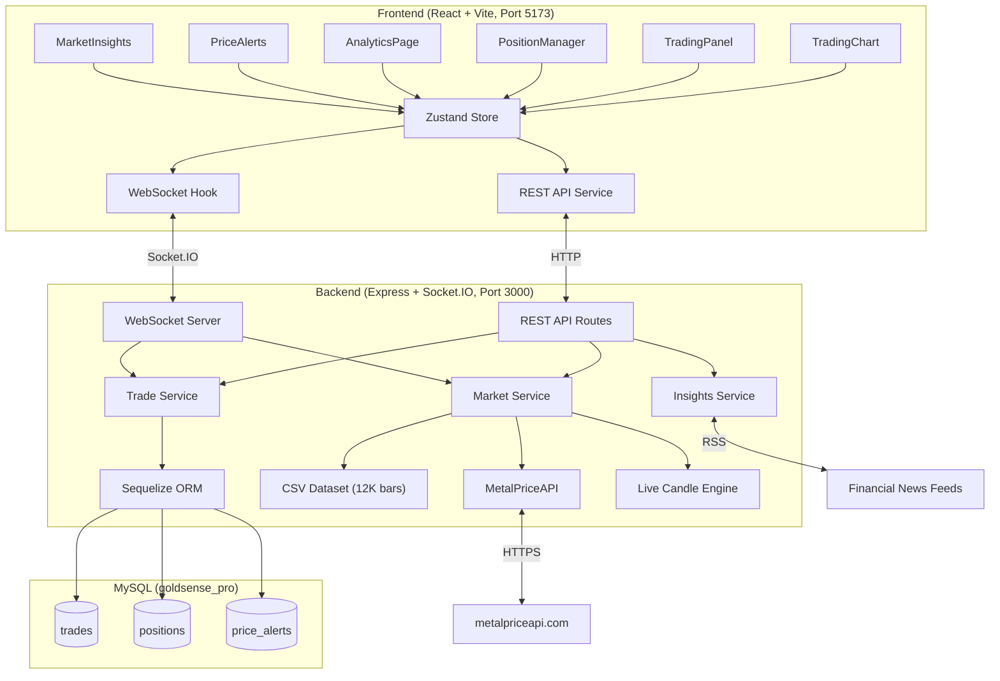

# GoldSense AI — XAU/USD Trading Companion


---

## 1. Introduction

**GoldSense AI** is an intelligent, full-stack web application designed as a personal companion for XAU/USD (Gold) traders. It provides a realistic paper-trading simulation environment where traders can practice, refine, and evaluate their strategies without risking real capital.

The platform combines **46+ years of historical gold price data** (1979–2026) with **real-time live market feeds**, **pre-computed technical indicators**, and an **AI-powered trade coaching engine** that reviews every closed trade and provides actionable feedback.

### Key Objectives

- **Strategy Simulation** — Allow traders to open and close paper trades with realistic market conditions including bid/ask spreads, stop-loss, and take-profit orders.
- **Data-Driven Insights** — Replace guesswork with real technical indicators (RSI, MACD, Bollinger Bands, SMA/EMA) computed from actual historical data.
- **AI Trade Analytics** — After every closed trade, the AI engine scores the trade (0–100), highlights what the trader did well, and suggests specific improvements.
- **Live Market Integration** — Fetch real-time gold prices from MetalPriceAPI and display live-updating candlestick charts.
- **Educational Value** — Help traders understand risk management, position sizing, and the importance of stop-losses through hands-on practice.

---

## 2. What We Have Done

### 2.1 Real-Time Trading Dashboard

The centerpiece of the application is a full-screen interactive trading workspace:

- **Live Candlestick/Line Chart** — Powered by TradingView's Lightweight Charts library, displaying 12,000+ daily bars from 1979 to present day. The chart updates in real-time every 5 seconds with live candle accumulation.
- **Toggleable Sidebar** — Contains the trading panel, open positions, signals, technical indicators, and price alerts. Can be collapsed to maximize chart space.
- **Below-the-Fold Analysis** — Scrolling below the chart reveals Market Insights, Performance Summary, Trade Journal, and Equity Curve.

### 2.2 Paper Trading Engine

A complete order management system built for realistic simulation:

| Feature | Description |
|---------|-------------|
| **Market Orders** | Instant execution at current bid (sell) or ask (buy) price with simulated spread |
| **Volume Selection** | Quick presets (0.1, 0.5, 1, 2, 5 oz) or custom quantity input |
| **Stop-Loss / Take-Profit** | Toggle-based SL/TP with distance input ($X away from entry) |
| **Risk:Reward Preview** | Shows dollar risk, dollar reward, and R:R ratio before order placement |
| **Order Confirmation** | Review dialog showing all order details before execution |
| **Position Management** | Close button with Yes/No confirmation, expandable position details |
| **Auto SL/TP Execution** | Server-side monitoring triggers SL/TP when price reaches levels (with 30s cooldown) |

All trades and positions are **persisted in MySQL** — they survive page refreshes and server restarts.

### 2.3 Real Technical Indicators (Dataset-Powered)

Instead of generating random indicator values, the platform loads **pre-computed, real technical indicators** from a 12,096-row enriched dataset:

- **RSI (14-period)** — Real Relative Strength Index values
- **MACD + Signal Line** — Real MACD oscillator with signal crossovers
- **Bollinger Bands** — Real upper, middle, and lower bands with standard deviation
- **SMA (20, 50)** — Real Simple Moving Averages
- **EMA (20, 50)** — Real Exponential Moving Averages
- **Volatility (30-day)** — Real rolling volatility
- **Trend Classification** — Pre-labeled trend direction from the dataset
- **Next-Day Prediction** — `target_next_close` and `target_direction` columns for AI signal generation

### 2.4 AI Market Insights Engine

A natural-language advice system that generates contextual trading commentary:

- Reads real technical indicator values (RSI overbought/oversold, MACD crossovers, Bollinger Band proximity)
- Fetches live financial news via RSS feeds (Investing.com, Yahoo Finance)
- Generates plain-English advice like: *"RSI is at 6.5 — extremely oversold. This often precedes a rebound, but falling-knife scenarios are possible. Wait for RSI to cross above 30 before entering."*
- News-aware suggestions when geopolitical events or Fed announcements are detected

### 2.5 AI Trade Analytics Page

A dedicated analytics dashboard accessible via the header button:

- **Performance Overview** — 4 hero stat cards (Balance, Return %, Win Rate, Profit Factor) + 6 mini stats
- **AI Performance Coach** — Natural-language summary of overall trading performance
- **Trade-by-Trade Review** — Each closed trade is expandable with:
  - **Score (0–100)** displayed as a circular SVG ring
  - **Verdict** — 🌟 Excellent / ✅ Good / ⚠️ Average / ❌ Needs Improvement
  - **What You Did Well** — Green-themed highlights (e.g., "Excellent risk management with both SL and TP set")
  - **How to Improve** — Amber-themed suggestions (e.g., "No Stop-Loss was set. Always protect your capital")
  - Pattern detection: consecutive losses (revenge trading warning), consecutive wins, position sizing analysis
- **Filter tabs** — View All / Wins only / Losses only

### 2.6 Price Alerts System

- Users set target price levels with direction (above/below)
- Alerts are **persisted in MySQL** (survive page refresh)
- Real-time monitoring: alerts trigger with visual pulse animation when price crosses the threshold
- Full CRUD: create, delete, trigger via backend API

### 2.7 Live Data Pipeline

```
MetalPriceAPI (every 5 min) → Backend Cache (30s) → WebSocket Broadcast (5s ticks)
       ↓                              ↓
  Real gold price            Simulated tick movements (±$1.5)
       ↓                              ↓
  Live candle accumulation → Chart updates in real-time
```

- **MetalPriceAPI** fetches the real XAU/USD price (API key: configured in `.env`)
- Between API calls, small tick simulations create realistic price movement
- A live OHLC candle is built from all ticks and appended to the chart
- WebSocket broadcasts `live-price` and `live-candle` events every 5 seconds

---

## 3. Tech Stack

### Frontend

| Technology | Version | Purpose |
|-----------|---------|---------|
| **React** | 19.x | UI framework — component-based architecture |
| **TypeScript** | 5.x | Type safety across the entire frontend |
| **Vite** | 6.4 | Build tool and dev server with HMR |
| **Tailwind CSS** | 4.x | Utility-first styling with custom design tokens |
| **Zustand** | 5.x | Lightweight state management (global store) |
| **Lightweight Charts** | 4.x | TradingView's charting library for candlestick/line charts |
| **Socket.IO Client** | 4.x | WebSocket connection for real-time data |
| **Lucide React** | — | Modern icon library |
| **Inter Font** | — | Professional typography via Google Fonts |

### Backend

| Technology | Version | Purpose |
|-----------|---------|---------|
| **Node.js** | 22.x | Runtime environment |
| **Express** | 4.x | HTTP server and REST API framework |
| **TypeScript** | 5.x | Type safety across the entire backend |
| **tsx** | — | TypeScript runner (replaced ts-node for ESM support) |
| **Sequelize** | 6.x | ORM for MySQL database operations |
| **MySQL** | 8.x | Relational database for persistent storage |
| **Socket.IO** | 4.x | WebSocket server for real-time broadcasting |
| **dotenv** | 17.x | Environment variable management |

### Data & APIs

| Source | Description |
|--------|-------------|
| **xauusd_gold_dataset.csv** | 12,096 rows of daily gold data (1979–2026) with 26 columns including pre-computed RSI, MACD, Bollinger Bands, SMA/EMA, trend labels, and ML prediction targets |
| **MetalPriceAPI** | Real-time gold price API (`metalpriceapi.com`) |
| **RSS Feeds** | Live financial news from Investing.com and Yahoo Finance for AI insights |

### Database Schema

```
┌─────────────────┐     ┌─────────────────┐     ┌─────────────────┐
│     trades       │     │   positions      │     │  price_alerts    │
├─────────────────┤     ├─────────────────┤     ├─────────────────┤
│ id (PK)         │◄──┐ │ id (PK)         │     │ id (PK)         │
│ type (BUY/SELL) │   └─│ tradeId (FK)    │     │ targetPrice     │
│ entryPrice      │     │ type (LONG/SHORT)│     │ direction       │
│ exitPrice       │     │ entryPrice      │     │ triggered       │
│ quantity        │     │ currentPrice    │     │ triggeredAt     │
│ stopLoss        │     │ quantity        │     │ createdAt       │
│ takeProfit      │     │ stopLoss        │     └─────────────────┘
│ pnl             │     │ takeProfit      │
│ status          │     │ unrealizedPnl   │
│ openedAt        │     │ status          │
│ closedAt        │     │ openedAt        │
│ notes           │     │ closedAt        │
└─────────────────┘     └─────────────────┘
```

### Architecture



---

## 4. Conclusion

GoldSense AI demonstrates the successful integration of **real financial data**, **modern web technologies**, and **artificial intelligence** to create a comprehensive trading simulation platform.

### Key Achievements

1. **Production-Grade Architecture** — Clean separation between frontend (React) and backend (Express) with TypeScript throughout, real database persistence, and WebSocket-based real-time communication.

2. **Data Integrity** — Rather than relying on random number generators, the platform uses **46 years of real gold market data** with pre-computed technical indicators, providing traders with an authentic simulation experience.

3. **AI-Powered Feedback Loop** — The trade analytics engine doesn't just show numbers — it provides **personalized, actionable coaching** for every trade, helping users learn from both their successes and mistakes.

4. **Real-Time Experience** — Live price feeds from MetalPriceAPI, WebSocket-driven chart updates, real-time position P&L tracking, and automated SL/TP execution create a near-authentic trading experience.

5. **Persistence & Reliability** — All trading data, positions, and alerts are stored in MySQL. The system handles schema migrations automatically and recovers gracefully from API failures by falling back to simulation mode.

### Future Enhancements

- **User Authentication** — JWT-based multi-user support with individual portfolios
- **Strategy Backtesting** — Test trading strategies against historical data with detailed performance metrics
- **ML Price Prediction** — Leverage the dataset's prediction columns to train and deploy a real-time price forecasting model
- **Mobile Responsiveness** — Optimize the UI for tablet and mobile trading
- **Paid Data Providers** — Integrate professional-grade data feeds for sub-second price updates

---

> **GoldSense AI** — *Empowering traders to learn, practice, and grow — without risking a single dollar.*
