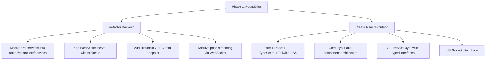
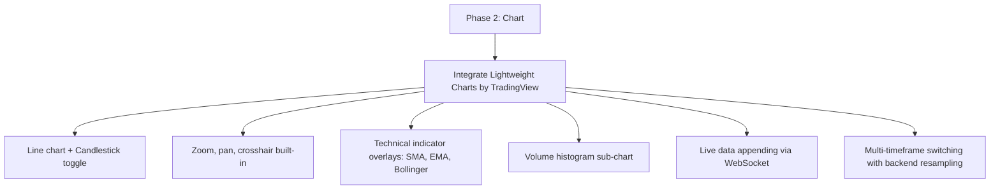
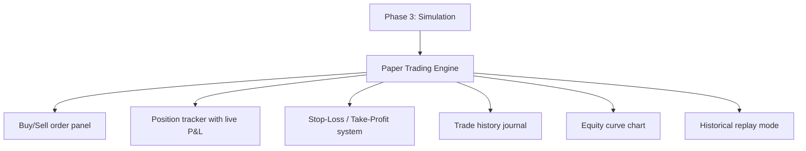
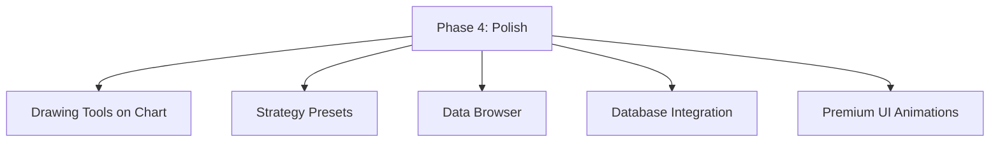

# 🏆 GoldSense AI — Feature Gap Analysis & Implementation Plan

## 📊 Current State Summary

### What Exists Today

| Layer | Technology | Status |
|-------|-----------|--------|
| **Frontend** | Vanilla HTML + Tailwind CSS 3 + Chart.js + plain JS | ⚠️ Needs migration to React + TS |
| **Backend** | Express.js (single `server.ts` monolith, 715 lines) | ⚠️ Needs modularization |
| **ML Pipeline** | Python (LSTM + XGBoost hybrid model) | ✅ Working |
| **Live API** | Metal-Price API (1 call/min, 1hr cache) | ⚠️ HTTP polling only |
| **Data** | `XAU_1d_data.csv` (289KB) + `XAU_1h_data.csv` (6.3MB) | ✅ Historical till 2024 |
| **Outputs** | Trained models (.h5, .pkl), predictions CSV, results JSON | ✅ Generated |

### Existing Backend Endpoints

| Endpoint | Method | Purpose |
|----------|--------|---------|
| `/live-price` | GET | Fetch live XAU/USD price (cached 1hr) |
| `/api-status` | GET | Cache & rate limit status |
| `/technical-analysis` | GET | RSI, MACD, Bollinger, Momentum |
| `/trading-signals` | GET | BUY/SELL/HOLD signals |
| `/predict` | GET | Run Python ML model on default data |
| `/upload-predict` | POST | Upload CSV + run model |
| `/prediction-data` | GET | Get predicted test set |
| `/trading-insights` | GET | Trend, suggestion, confidence |
| `/support-resistance` | GET | Support/resistance levels |
| `/latest-prediction` | GET | Latest single prediction |
| `/sample-data` | GET | CSV format guidance |

### Existing Frontend Modules

| File | Purpose | Lines |
|------|---------|-------|
| [app.js](file:///d:/College_Semester_notes/Sem_5_Notes/PBL/PBL_Final/frontend/js/app.js) | Main app logic, API calls, notifications | 875 |
| [charts.js](file:///d:/College_Semester_notes/Sem_5_Notes/PBL/PBL_Final/frontend/js/charts.js) | Chart.js price/technical charts | 460 |
| [simulation.js](file:///d:/College_Semester_notes/Sem_5_Notes/PBL/PBL_Final/frontend/js/simulation.js) | Stepwise prediction simulator | 476 |
| [live-market.js](file:///d:/College_Semester_notes/Sem_5_Notes/PBL/PBL_Final/frontend/js/live-market.js) | Live price polling & display | 274 |

---

## 🔴 Missing Features — Full Breakdown

### Category 1: Interactive Chart & Charting Tools

> [!IMPORTANT]
> The current chart is a basic Chart.js line chart with no professional trading tools. A trader needs TradingView-level interactivity.

| # | Missing Feature | Priority | Description |
|---|----------------|----------|-------------|
| 1 | **Candlestick Chart** | 🔴 Critical | Traders need OHLC candlestick view, not just line charts. Line chart should be a toggle option. |
| 2 | **Zoom & Pan** | 🔴 Critical | No ability to zoom into specific time ranges or pan across history. |
| 3 | **Crosshair Cursor** | 🔴 Critical | No crosshair that follows the mouse showing exact price/time at cursor position. |
| 4 | **Drawing Tools** | 🟡 Important | Trendlines, horizontal levels, Fibonacci retracements — essential for strategy testing. |
| 5 | **Technical Indicator Overlays** | 🟡 Important | SMA/EMA, Bollinger Bands, VWAP drawn *on* the chart, not just as numbers in a card. |
| 6 | **Volume Bars** | 🟡 Important | Volume histogram below the price chart. |
| 7 | **Multi-Timeframe Toggle** | 🟡 Important | Switch between 1m, 5m, 15m, 1H, 4H, 1D, 1W timeframes with actual data resampling. |
| 8 | **Chart Type Toggle** | 🟢 Nice | Switch between Line, Candlestick, Area, Heikin-Ashi views. |

### Category 2: Strategy Simulation Engine

> [!IMPORTANT]
> Current simulation is a simple "play-through" of predictions. A real strategy simulator needs paper trading capabilities.

| # | Missing Feature | Priority | Description |
|---|----------------|----------|-------------|
| 9 | **Paper Trading (Buy/Sell buttons)** | 🔴 Critical | Trader should be able to click Buy/Sell at any point during simulation to test their own strategy, track P&L. |
| 10 | **Position Management** | 🔴 Critical | Open/close positions, set lot size, see unrealized P&L in real-time. |
| 11 | **Stop-Loss / Take-Profit** | 🟡 Important | Set SL/TP levels on positions, auto-close when hit. |
| 12 | **Trade Journal / History** | 🟡 Important | Log of all simulated trades with entry/exit price, duration, P&L. |
| 13 | **Equity Curve** | 🟡 Important | Separate chart showing account balance over time during simulation. |
| 14 | **Strategy Presets** | 🟢 Nice | Pre-built strategies (MA crossover, RSI overbought/oversold) that auto-trade during simulation. |

### Category 3: Real-Time Live Data Streaming

> [!WARNING]
> Current approach uses HTTP polling every 5 seconds. This is inefficient and doesn't give true real-time feel. The graph does NOT update live — it only refreshes a price number.

| # | Missing Feature | Priority | Description |
|---|----------------|----------|-------------|
| 15 | **WebSocket Server** | 🔴 Critical | Backend should push price updates via WebSocket instead of client polling HTTP. |
| 16 | **Live Chart Appending** | 🔴 Critical | New price ticks must append to the chart in real-time (the line keeps extending). Currently the chart only renders on full data reload. |
| 17 | **Configurable Polling Interval** | 🟡 Important | Let user choose update frequency (1s, 5s, 15s, 30s, 1m). |
| 18 | **Connection Status Indicator** | 🟢 Nice | Visual indicator showing WebSocket connection health (already partially exists). |

### Category 4: Backend Architecture (Node.js + TypeScript)

> [!WARNING]
> The entire backend is a single 715-line `server.ts` file. The `src/` directory (controllers, routes, services, models, config, middleware) is completely empty — all scaffolded but unused.

| # | Missing Feature | Priority | Description |
|---|----------------|----------|-------------|
| 19 | **Modular Route Handlers** | 🔴 Critical | Split monolithic server.ts into proper controllers/routes/services. |
| 20 | **WebSocket Integration** | 🔴 Critical | Add `socket.io` or `ws` for real-time data push to frontend. |
| 21 | **Historical Data API** | 🔴 Critical | Endpoint to serve CSV historical data as paginated JSON (for chart rendering). |
| 22 | **OHLC Data Endpoint** | 🟡 Important | Serve OHLC candle data at different timeframes (resample from hourly CSV). |
| 23 | **Trade Simulation State API** | 🟡 Important | Backend endpoints to manage paper trading state (positions, balance, history). |
| 24 | **Database Integration** | 🟢 Nice | `.env` has MySQL config but no database code exists. Could store trades, user preferences. |

### Category 5: Frontend Migration (React + TypeScript + Tailwind CSS)

> [!IMPORTANT]
> Current frontend is vanilla HTML/JS. Needs complete rewrite to React 19 + TypeScript + Tailwind CSS.

| # | Missing Feature | Priority | Description |
|---|----------------|----------|-------------|
| 25 | **React App Scaffolding** | 🔴 Critical | Create React app with Vite, TypeScript, Tailwind CSS. |
| 26 | **Component Architecture** | 🔴 Critical | Split UI into reusable components (Chart, Sidebar, TradePanel, Signals, etc.). |
| 27 | **State Management** | 🔴 Critical | React Context or Zustand for global state (live price, positions, simulation). |
| 28 | **Professional Charting Library** | 🔴 Critical | Replace Chart.js with **Lightweight Charts** (TradingView) for trading-grade charts. |
| 29 | **Responsive Layout** | 🟡 Important | Proper responsive grid with collapsible panels. |
| 30 | **Dark/Light Theme System** | 🟢 Nice | Already partially exists, needs proper React context. |

### Category 6: Historical Data Management

| # | Missing Feature | Priority | Description |
|---|----------------|----------|-------------|
| 31 | **Data Browser** | 🟡 Important | UI to browse/filter historical data, jump to specific dates. |
| 32 | **Replay Mode** | 🟡 Important | "Walk forward" through historical data at configurable speed, as if it were live. |
| 33 | **Data Import/Export** | 🟢 Nice | Import custom CSV data, export simulation results. (Partially exists). |

---

## 🏗️ Implementation Plan

### Phase 1: Foundation (Backend Refactoring + React Scaffold)

### Phase 2: Interactive Chart

### Phase 3: Strategy Simulation

### Phase 4: Polish & Extras

---

## 🛠️ Proposed Tech Stack

| Layer | Current | Proposed |
|-------|---------|----------|
| **Frontend Framework** | Vanilla HTML/JS | **React 19 + TypeScript** |
| **Styling** | Tailwind CSS 3 (CDN-compiled) | **Tailwind CSS v4** (Vite plugin) |
| **Charting** | Chart.js | **Lightweight Charts (TradingView)** |
| **State Management** | Global `window.*` | **Zustand** |
| **Real-time** | HTTP polling (fetch) | **Socket.IO client** |
| **Backend Framework** | Express (monolith) | **Express (modular)** |
| **Real-time Server** | None | **Socket.IO** |
| **Build Tool** | None (direct serve) | **Vite** |

---

## ❓ Decisions Needed From You

1. **Charting Library**: Should I use **Lightweight Charts** (TradingView's open-source library — best for trading) or stick with Chart.js?

2. **Scope for first build**: Should I implement **all phases at once**, or start with **Phase 1 + Phase 2** (foundation + interactive chart with live updates) and iterate?

3. **Database**: The `.env` has MySQL config. Should I integrate MySQL for storing trade history, or keep it in-memory / local storage for now?

4. **Tailwind Version**: You mentioned Tailwind CSS — should I use **Tailwind CSS v4** (latest, Vite-native) or **v3** (more stable, more community resources)?

5. **Keep Python ML Pipeline as-is?**: The Python LSTM+XGBoost model works. Should it stay untouched, or do you want modifications?
